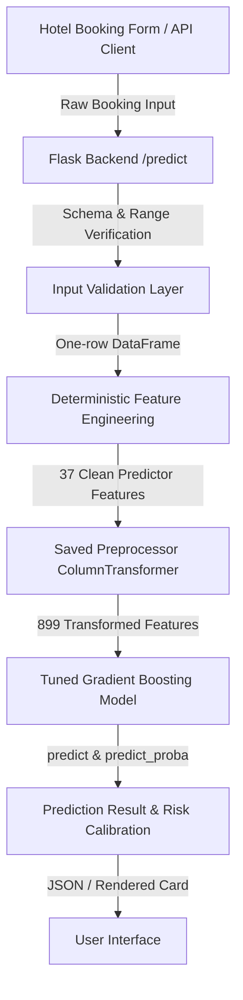

# Hotel Booking Cancellation Prediction

University Data Mining mini-project for predicting the binary target
`is_canceled` (`0` = not cancelled / honored, `1` = cancelled).

## Progress Evaluation 1 Scope

The repository covers exploratory data analysis, data-quality handling,
leakage investigation, feature engineering, and a reusable preprocessing pipeline.

### Data and Project Flow
The source dataset is `data/raw/hotel_bookings.csv` (119,390 rows and 32 columns).
Evaluation 1 notebooks run in this order:

1. `notebooks/eda/member1_eda.ipynb`
2. `notebooks/data_quality/member2_data_quality.ipynb`
3. `notebooks/feature_engineering/member3_feature_engineering.ipynb`
4. `notebooks/preprocessing/member4_preprocessing.ipynb`

Each notebook uses repository-relative paths. Member 4 recreates the approved
Member 2 and Member 3 handoff through the reusable functions under `src/`, so it
does not depend on hidden notebook state.

### Reproduce the Evaluation 1 Workflow
Install the pinned environment from the repository root:

```powershell
python -m pip install -r requirements.txt
```

Execute each notebook from a clean kernel:

```powershell
python -m nbconvert --to notebook --execute --inplace notebooks\eda\member1_eda.ipynb --ExecutePreprocessor.timeout=600
python -m nbconvert --to notebook --execute --inplace notebooks\data_quality\member2_data_quality.ipynb --ExecutePreprocessor.timeout=600
python -m nbconvert --to notebook --execute --inplace notebooks\feature_engineering\member3_feature_engineering.ipynb --ExecutePreprocessor.timeout=600
python -m nbconvert --to notebook --execute --inplace notebooks\preprocessing\member4_preprocessing.ipynb --ExecutePreprocessor.timeout=600
```

---

## Evaluation 2 – Model Development

For Progress Evaluation 2, four diverse machine learning algorithms spanning linear, single-tree, bagging, and boosting paradigms were implemented, evaluated at baseline, and systematically optimized via cross-validation:

1. **Member 1 – Logistic Regression:** Regularized linear model producing calibrated probability estimates.
2. **Member 2 – Decision Tree:** Non-parametric recursive splitting model capturing non-linear interactions.
3. **Member 3 – Random Forest:** Bagging ensemble of 150 decorrelated decision trees reducing variance.
4. **Member 4 – Gradient Boosting:** Sequential boosting ensemble iteratively optimizing pseudo-residuals.

### Scientific Benchmarking Standards
To guarantee a completely fair and leakage-free comparison:
- **Same Preprocessing Pipeline:** Fitted exclusively on training data (`X_train`) and applied downstream.
- **Leakage Columns Excluded:** `reservation_status` and `reservation_status_date` were excluded from all models.
- **Same Train/Test Split:** Stratified 80/20 partition (`random_state=42`).
- **Target Variable:** `is_canceled` (0 = Honored, 1 = Canceled).
- **Training Set Size:** **69,782** bookings.
- **Holdout Test Set Size:** **17,446** bookings.
- **Actual Test Cancellations:** **4,802** bookings (27.52% cancellation rate).
- **Same Evaluation Metrics:** Accuracy, Precision, Recall, $F_1$-score, and ROC-AUC.

### Verified Tuned Model Comparison Table

| Model | Stage | Accuracy | Precision | Recall | F1-Score | ROC-AUC | Best CV F1 | Overfitting Gap |
| :--- | :--- | :--- | :--- | :--- | :--- | :--- | :--- | :--- |
| **Logistic Regression** | Tuned | 0.7863 | 0.5772 | 0.8357 | 0.6828 | 0.8776 | 0.6719 | -0.0031 |
| **Decision Tree** | Tuned | 0.7974 | 0.5895 | **0.8696** | 0.7027 | 0.8783 | 0.6994 | 0.0275 |
| **Random Forest** | Tuned | 0.7835 | 0.5716 | 0.8521 | 0.6842 | 0.8909 | 0.6822 | 0.0086 |
| **Gradient Boosting** | **Tuned** | **0.8501** | **0.7565** | 0.6714 | **0.7114** | **0.9152** | **0.7076** | **0.0062** |

All experimental records are preserved in [`results/modeling/model_comparison.csv`](results/modeling/model_comparison.csv).

---

## Final Model

**Tuned Gradient Boosting Classifier** was selected as the champion model for the project after multi-metric evaluation against all candidates.

### Verified Champion Results
- **Accuracy:** **0.8501** (85.01% of test reservations predicted correctly)
- **Precision:** **0.7565** (75.65% of predicted cancellations are true cancellations)
- **Recall:** **0.6714** (67.14% of actual cancellations successfully detected)
- **F1-Score:** **0.7114** (Highest balanced harmonic score among all models)
- **ROC-AUC:** **0.9152** (Outstanding discrimination across all probability thresholds)
- **5-Fold CV F1:** **0.7076** (Robust training validation score)
- **Overfitting Gap:** **0.0062** (Train accuracy 85.62% vs Test accuracy 85.01% — negligible 0.62 pp gap)

### Selection Justification & Metric Trade-Offs
1. **Superior Overall Discrimination (ROC-AUC 0.9152):** Gradient Boosting achieves the highest area under the ROC curve by a clear margin, meaning hotel operators can dynamically calibrate classification thresholds based on seasonal capacity needs.
2. **Best Precision-Recall Balance ($F_1$ 0.7114):** While Decision Tree and Random Forest achieved higher raw Recall by aggressive class-weight penalties, their Precision plummeted to ~57% (generating excessive false alarms). Gradient Boosting maintained high Precision (75.65%) while catching 3,224 cancellations.
3. **Generalization and Stability:** The model displays virtually zero overfitting (0.0062 gap), ensuring high reliability when deployed into production.

### Saved Production Artifacts
- **Final Model:** [`results/modeling/final_gradient_boosting_model.joblib`](results/modeling/final_gradient_boosting_model.joblib)
- **Final Preprocessor:** [`results/modeling/final_preprocessor.joblib`](results/modeling/final_preprocessor.joblib)
- **Combined Bundle:** [`results/modeling/final_model_bundle.joblib`](results/modeling/final_model_bundle.joblib)
- **Model Metadata:** [`results/modeling/final_model_metadata.json`](results/modeling/final_model_metadata.json)

### Evaluation 2 Study & Viva Resources
- Group Study Guide (20 Core Questions): [`results/modeling/evaluation2_viva_notes.md`](results/modeling/evaluation2_viva_notes.md)
- Member 3 Random Forest Guide (Ensemble Concepts & 15 Questions): [`results/modeling/member3_random_forest_viva.md`](results/modeling/member3_random_forest_viva.md)

---

## Final Prediction System

An interactive, reliable, and user-friendly web application developed for live stakeholder demonstration, built directly on top of the saved champion model.

- **Final Model**: Tuned Gradient Boosting Classifier (`results/modeling/final_gradient_boosting_model.joblib`)
- **Fitted Preprocessor**: Scikit-learn ColumnTransformer (`results/modeling/final_preprocessor.joblib`)
- **Combined Bundle**: Single-load package (`results/modeling/final_model_bundle.joblib`)
- **Backend Architecture**: Python Flask service exposing `/` (Web UI), `/predict` (Inference API), `/health` (Service diagnostics), and `/api/demo-cases` (Pre-calculated test set presets).
- **Frontend Architecture**: Clean HTML5 semantic layout styled with custom responsive Vanilla CSS and interactive AJAX JavaScript. No external UI build steps required.
- **Safety Guarantee**: The production pipeline **never calls `fit()`** or retrains the model. Leakage columns (`reservation_status`, `reservation_status_date`) and the target variable (`is_canceled`) are strictly prohibited and excluded from user inputs.

### System Architecture



### Prediction Flow
1. **User Input**: 26 original, domain-level reservation parameters are entered across 5 intuitive form sections via dropdowns, date pickers, and numeric fields (or loaded instantly using the 1-click Demo Presets).
2. **Validation**: Enforces non-negative bounds, minimum guest counts ($\ge 1$), valid categories, and rejects leakage columns.
3. **Feature Engineering**: Deterministically derives the 8 domain features:
   - `total_guests = adults + children + babies`
   - `total_stay = stays_in_week_nights + stays_in_weekend_nights`
   - `is_family = (children + babies > 0)`
   - `room_changed = (reserved_room_type != assigned_room_type)`
   - `has_special_requests = (total_of_special_requests > 0)`
   - `has_previous_cancellations = (previous_cancellations > 0)`
   - `has_previous_bookings = (previous_bookings_not_canceled > 0)`
   - `is_weekend_only = (stays_in_weekend_nights > 0 and stays_in_week_nights == 0)`
4. **Transformation**: The pre-fitted `ColumnTransformer` imputes missing values and encodes categorical features into exactly **899 features**.
5. **Inference**: Gradient Boosting model outputs binary prediction (0: Honored / 1: Cancelled) and class probabilities.
6. **Presentation**: The UI displays the outcome badge (`LIKELY NOT TO CANCEL` or `LIKELY TO CANCEL`), probability meters, risk classification tier, and a business advisory note.

---

## Running the Application

### 1. Install Dependencies
Ensure you are in the project root:

```powershell
python -m pip install -r requirements.txt
```

### 2. Start the Web Server
Launch the Flask application:

```powershell
python app/app.py
```

Or via module syntax:

```powershell
python -m app.app
```

### 3. Open in Browser
Visit the local server address:

```text
http://127.0.0.1:5000
```

### 4. Run Automated Test Suite
Execute the full test suite covering validation, inference, feature engineering, and backend endpoints:

```powershell
python -m pytest tests -v
```

